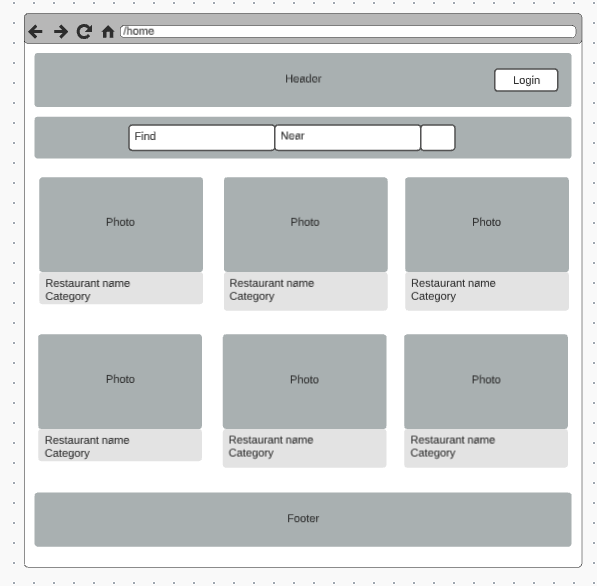
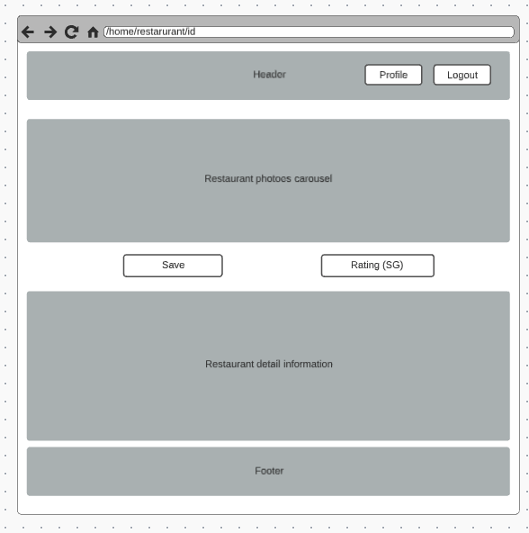
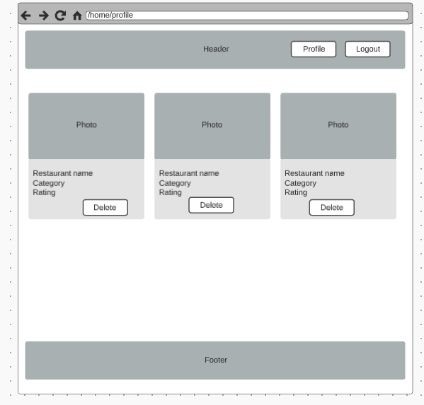
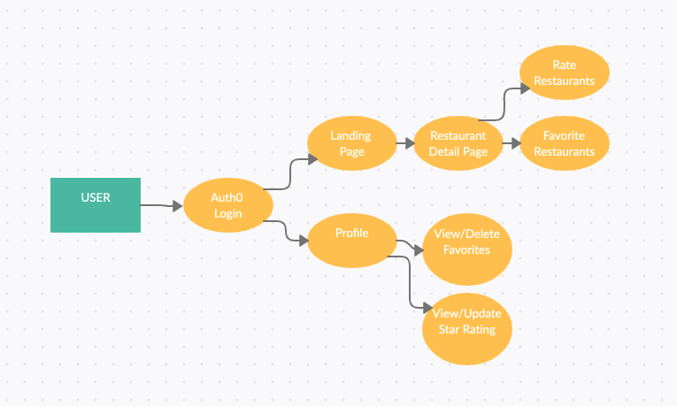

# Picknic front end

**Team member:** Alexander Williams, Daniel Dills, Garfield Grant, Wenhao Piao

## Project name: PICKNIC

The concept of this project is to have the user search and save a list of their fave restaurants and give that restaurant a rating.

## How to start the app

## User Stories

[Trello Link](https://trello.com/b/YCSNFquJ/picknic)

1. As a user, I want to search restaurant by keyword and location and see it.
2. As a user, I want to favor restaurants and see them on my profile page.
3. As a user, I want to rate the restaurants and see the ratings on my profile page.
4. As a user, I want to delete the saved restaurants when I don't like them anymore.
5. As a user, I want to sign into the app and see the user profile.
6. As a user, I want to be able to change the rating on saved restaurants.

## Wireframes

## Domain Modeling

## Software Requirements

[Software Requirements](./requirements.md)

## Team Agreement

[Team Agreement](./team-agreement.md)
